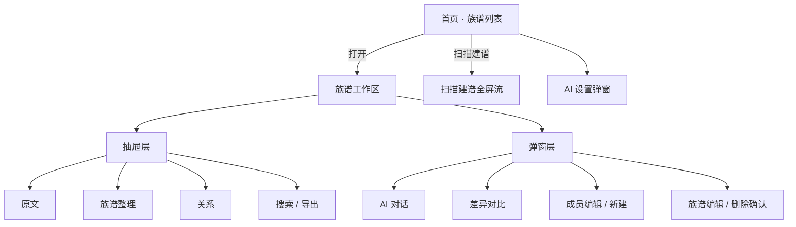
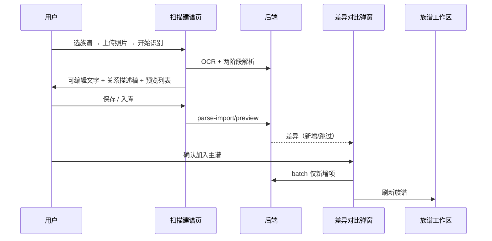
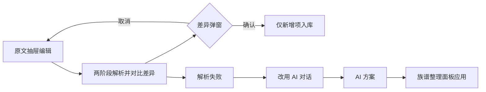
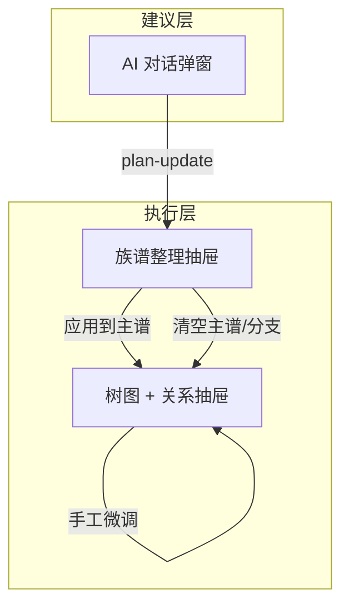

# 族见 · 界面交互 PRD（当前实现版）

> **见家族，见自己**  
> **文档版本**：v1.0 · 2026-05  
> **适用范围**：`src/App.vue` 及现有 Vue 组件的**页面结构、交互流程、弹窗/抽屉分工**  
> **关联文档**：功能与 API 见 [`PRD.md`](./PRD.md)（保留不变，本文不重复业务规则与后端接口细节）

---

## 1. 文档目的

原 [`PRD.md`](./PRD.md) 聚焦**功能、数据、API、智能体能力**，刻意不含 UI 细则。  
本文档基于**当前已上线界面**，补全：

- 信息架构与页面地图  
- 各区域职责与用户操作路径  
- **「对话 / 整理 / 可视化 / 差异确认」四层分工**（2026-05 重构后的核心交互原则）  
- 抽屉、弹窗、对比确认类交互的统一规范  

---

## 2. 核心交互原则

### 2.1 四层分工（必须遵守）

| 层级 | 载体 | 职责 | 禁止 |
|------|------|------|------|
| **可视化主工作区** | 左导航 + 中树图 + 右详情 + 关系抽屉 | 查看、选中、手工增删改成员与关系 | 不直接跑 AI、不静默批量入库 |
| **族谱整理** | 顶栏「族谱整理」抽屉 | 清空主谱/分支、预览并**应用** AI 方案、干净整理选项 | 不做多轮 AI 对话 |
| **AI 对话** | 「AI 对话」弹窗 | 自然语言沟通、列出关系建议、同步方案到整理面板 | 不清空主谱、不直接写库 |
| **差异确认** | 对比弹窗 | 解析结果 vs 主谱、原文 vs 主谱；**仅入库用户确认的新增项** | 不做无预览的 merge |

### 2.2 数据写入铁律

1. **两阶段解析**（OCR 原文 → 关系描述稿 → 数字化 JSON）**不得**直接整批 merge 入主谱。  
2. 任何「版本/解析结果 → 主谱」的路径，必须先走 **差异计算 → 用户确认 → 仅写入新增项**。  
3. 主谱中已存在的成员、关系在 UI 上明确标注为「跳过」，避免重复入库。  
4. 破坏性操作（清空主谱、清空分支、干净替换）必须二次确认，并说明不可撤销范围。

### 2.3 反馈与状态

- 长任务：按钮文案切换为「…中…」，禁用重复点击。  
- 成功/失败：`toast` 提示；阻断性错误用 `alert` 或弹窗内说明。  
- 有待处理方案：顶栏「族谱整理」显示 **badge `1`**。  

---

## 3. 信息架构



### 3.1 全局顶栏（首页）

| 元素 | 行为 |
|------|------|
| Logo +  slogan | 品牌展示 |
| 扫描建谱 | 进入 OCR 全屏流 |
| ⚙ | 打开 AI 设置 |

### 3.2 族谱工作区布局

```
┌─────────────────────────────────────────────────────────────┐
│ 顶栏：返回 | 族谱名 | 统计 | 工具按钮群                        │
├─────────────────────────────────────────────────────────────┤
│ 抽屉层（按需展开，可多个互斥或叠加，见 §5）                      │
├──────────┬──────────────────────────────┬───────────────────┤
│ 世代导航  │  树图画布（缩放/连线/拖拽）    │  成员详情侧栏      │
│ 左栏     │  中栏                         │  右栏              │
└──────────┴──────────────────────────────┴───────────────────┘
```

---

## 4. 顶栏工具按钮（工作区）

| 按钮 | 类型 | 交互 |
|------|------|------|
| + 新增人物 | 即时 | 打开成员表单弹窗 |
| 导入 / 导出 | 抽屉 | 切换对应 drawer |
| 搜索 | 抽屉 | 关键词 / NL 搜索 |
| 备份 | 即时 | 本地 JSON 备份下载 |
| 原文 | 抽屉 | 原文版本 + OCR 工作区 + 两阶段解析 |
| 关系 | 抽屉 | 关系列表 + 手工添加关系 |
| 编辑族谱 | 弹窗 | 族谱元信息 |
| **族谱整理** | 抽屉 | §6.2；有待应用方案时 badge |
| **AI 对话** | 弹窗 | §6.3 |
| 快速整理 | 弹窗 | 主谱 vs 原文对比 → 确认补关系 |
| 扫描 | 跳转 | 从当前族谱进入 OCR 流 |
| ⚙ | 弹窗 | AI 设置 |

---

## 5. 抽屉（Drawer）规范

抽屉位于顶栏下方、三栏主体上方，共用 `.workspace-drawer` 样式。

| 抽屉 | 开关 | 主要内容 |
|------|------|----------|
| **原文** | 顶栏「原文」 | 原文版本选择、另存为、确认此版、删除此版；`OcrTextWorkspace`；两阶段解析并对比差异；改用 AI 对话 |
| **族谱整理** | 顶栏「族谱整理」 | 见 §6.2 |
| **关系** | 顶栏「关系」 | 下拉选成员建关系；全量关系列表删改 |
| **搜索** | 顶栏「搜索」 | 搜索框与结果 |
| **导出** | 顶栏「导出」 | JSON / PDF 等 |

**互斥建议**（当前实现为独立 toggle，用户可同时开多个；后续可优化为同类抽屉互斥）。

---

## 6. 弹窗（Modal）规范

### 6.1 差异对比弹窗 `SourceCompareDialog`

**两种模式**（`mode: source | parse`）：

| 模式 | 标题 | 触发场景 | 确认按钮 |
|------|------|----------|----------|
| `source` | 主谱 vs 原文对比 | 「快速整理」dry-run | 应用整理（+N 关系） |
| `parse` | 解析结果 vs 主谱 | 两阶段解析、OCR 保存入库 | 确认加入主谱（+N 人、+M 关系） |

**必须展示的信息块**：

- 当前主谱人数 / 关系数  
- 对比侧人数 / 关系数（原文解析 或 本次解析）  
- 提示摘要（hints）  
- 可折叠明细：将新增 / 将跳过 / 暂无法入库  
- 无新增项时：主按钮禁用，文案「无新增项」  

**底部操作**：

- `source` 模式：打开原文编辑 | 取消 | 确认应用  
- `parse` 模式：取消 | 确认加入主谱（不显示「打开原文」）  

### 6.2 族谱整理面板 `GenealogyOrganizePanel`

**定位**：主谱的「执行控制台」—— 一切**写库级整理**在此完成。

| 区块 | 内容 |
|------|------|
| 标题区 | 「族谱整理」说明 + **打开 AI 对话** |
| 工具条 | 干净整理 checkbox；清空全部主谱；清空当前分支（需左侧选中成员） |
| 待应用方案 | AI 方案差异预览：人数/关系前后、增删明细、应用方式（增量/干净替换）、**应用到主谱** |
| 空态 | 提示通过 AI 对话获取方案 |

**交互规则**：

- 应用成功后刷新树图，清除待应用方案。  
- 清空主谱/分支后保留族谱记录与原文版本。  
- `干净整理` 影响下一次 AI 请求语义（按方案重建，不保留旧错关系）。  

### 6.3 AI 对话弹窗 `AiOrganizeDialog`

**定位**：**只对话、只建议**，不直接改主谱。

| 区块 | 内容 |
|------|------|
| 标题 | AI 对话助手 |
| 会话控制 | 刷新主谱上下文；清空对话（含智能体 session） |
| 聊天区 | 多轮气泡；显示会话轮次 / 摘要模式 |
| 关系摘要 | 精简列表（详情引导至「族谱整理」） |
| 输入区 | 附带原文、干净整理；从原文生成方案；发送 |

**方案同步**：

- AI 返回可应用方案 → `plan-update` 事件 → 主界面写入待应用方案 → 自动打开「族谱整理」抽屉 → toast 提示。  

### 6.4 其他弹窗

| 弹窗 | 用途 |
|------|------|
| 成员编辑 / 新建 | 表单 CRUD |
| 族谱编辑 | 名称、姓氏、始祖等 |
| 删除族谱 | 输入族谱名确认（高危） |
| AI 设置 | Provider、Key、模型选择、测试 |

---

## 7. 关键用户流程

### 7.1 扫描建谱（全屏 OCR 流）



**步骤说明**：

1. **选择族谱** → **上传** → **识别**（三步指示点）  
2. 结果页：左侧 `OcrTextWorkspace`（标注、连线、拖拽入待入库列表）  
3. 展示「关系描述稿」：可采用为校对原文 / 复制  
4. 「两阶段解析（描述稿→数字化）」仅更新预览，不直接入库  
5. 「保存到族谱」→ **必须先对比差异** → 用户确认后入库  

### 7.2 工作区内：原文 → 主谱



### 7.3 AI 辅助整理（对话与执行分离）



### 7.4 快速整理（原文对比补关系）

1. 顶栏「快速整理」  
2. 后端 dry-run：`rebuild` + `compare_genealogy_with_source`  
3. 差异弹窗（`source` 模式）展示缺失关系等  
4. 用户确认后执行 rebuild 写库  

---

## 8. 三栏主工作区交互细则

### 8.1 左侧 · 世代导航

- 树形折叠/展开；点击姓名选中成员（高亮）。  
- 选中态驱动：右栏详情、清空分支、新增子女挂接父节点。  
- 空态：「暂无成员」。  

### 8.2 中间 · 树图画布

| 能力 | 交互 |
|------|------|
| 版式 | 苏式 / 欧式 / 宝塔 / 垂丝 / 圆形 |
| 视图 | 缩放 ±、适应屏幕、重置、拖拽平移 |
| 连线模式 | 依次点两节点建立关系 |
| 节点 | 单击选中；双击 focus；支持姓名拖拽入谱 |
| 边线 | 绝对布局 SVG 层（垂丝/圆形） |

### 8.3 右侧 · 成员详情

- 基本字段、父母配偶链接、关联关系列表（可删）。  
- 快捷：+ 子女 / 孙 / 曾孙；编辑；删除。  
- 空态：提示在树中点击节点。  

### 8.4 关系抽屉

- 表单：父/夫 → 子/妻，类型，状态。  
- 列表：逐条删除。  

---

## 9. 原文版本管理（原文抽屉内）

| 操作 | 说明 |
|------|------|
| 版本下拉 | 切换草稿/已确认版本 |
| 另存为… | 命名新版本 |
| 确认此版 | 标记为 confirmed，供 AI/整理优先引用 |
| 删除此版 | 至少保留一版；不可删唯一版本 |
| 保存原文 | 仅保存文本与标注，不解析 |

---

## 10. 组件清单（前端）

| 组件 | 路径 | 类型 |
|------|------|------|
| App | `src/App.vue` | 壳 + 路由态 |
| OcrTextWorkspace | `components/OcrTextWorkspace.vue` | 原文编辑/标注 |
| GenealogyOrganizePanel | `components/GenealogyOrganizePanel.vue` | 整理抽屉 |
| AiOrganizeDialog | `components/AiOrganizeDialog.vue` | AI 对话弹窗 |
| SourceCompareDialog | `components/SourceCompareDialog.vue` | 差异对比弹窗 |

---

## 11. 空态 / 错误 / 兜底

| 场景 | 表现 | 兜底路径 |
|------|------|----------|
| 解析 0 成员 | toast + 抽屉内 hint | 改用 AI 对话整理 |
| 合并/入库失败 | toast + hint | AI 对话 / 手工录入 |
| 无 AI Key | 设置页配置；本地规则降级 | 关系抽屉手工建谱 |
| 无待应用方案 | 整理抽屉空态文案 | 打开 AI 对话 |
| 对比无新增项 | 弹窗「无新增项」，按钮禁用 | 返回编辑原文 |

---

## 12. 视觉与布局（简要）

详细色板见 [`PRD.md` 附录 B](./PRD.md#附录-b品牌色功能-prd-保留细节以-ui-prd-为准)。  
当前实现：`src/styles/theme.css`，暖棕族谱风格。

| Token | 用途 |
|-------|------|
| `--font-serif` | 标题、族谱名 |
| `.workspace-drawer` | 抽屉容器 |
| `.modal` / `.modal-lg` | 弹窗 |
| `.toolbar-badge` | 待办角标 |
| `.ai-organize-*` / `.source-compare-*` | 整理与对比专用块 |

**响应式**：工作区三栏在窄屏下详情可折叠（`detailMobileOpen`）；OCR 结果页左右分栏。

---

## 13. 与功能 PRD 的接口对应

| UI 交互 | 功能 PRD / API |
|---------|----------------|
| 两阶段解析对比 | `POST /api/ocr/parse` → `POST .../parse-import/preview` → `POST /api/persons/batch` |
| 快速整理对比 | `POST .../rebuild`（dry_run）→ compare |
| AI 对话 | `POST .../ai-organize`（session、clean_slate） |
| 整理应用 | `POST .../ai-organize`（persist + apply_mode） |
| 清空主谱 | `POST .../clear-genealogy` |
| 原文版本 | `source-versions` 系列 API |

---

## 14. 已知限制与后续 UI  backlog

| 项 | 现状 | 建议迭代 |
|----|------|----------|
| 抽屉可同时多开 | 可能占满垂直空间 | 同类互斥或 Tab |
| 删除成员 | 一级 confirm | 姓名输入确认（对齐 F-Del-01） |
| 树图 | 简易 SVG，非无限画布 | F-Vis-01 矢量树 |
| 对比弹窗 | 不可勾选部分入库 | 按条目 checkbox 采纳 |
| 移动端 | 基础可用 | 抽屉全屏化、手势优化 |

---

## 15. 修订记录

| 版本 | 日期 | 说明 |
|------|------|------|
| v1.0 | 2026-05 | 基于当前实现：四层分工、差异确认入库、整理/对话分离 |

---

## 附录：页面 → 文件速查

| 用户可见页面 | 主要代码 |
|--------------|----------|
| 首页列表 | `App.vue` § section 无 currentFamily |
| 族谱工作区 | `App.vue` § currentFamily |
| 扫描建谱 | `App.vue` § showOCR |
| 族谱整理抽屉 | `GenealogyOrganizePanel.vue` |
| AI 对话 | `AiOrganizeDialog.vue` |
| 差异对比 | `SourceCompareDialog.vue` |
