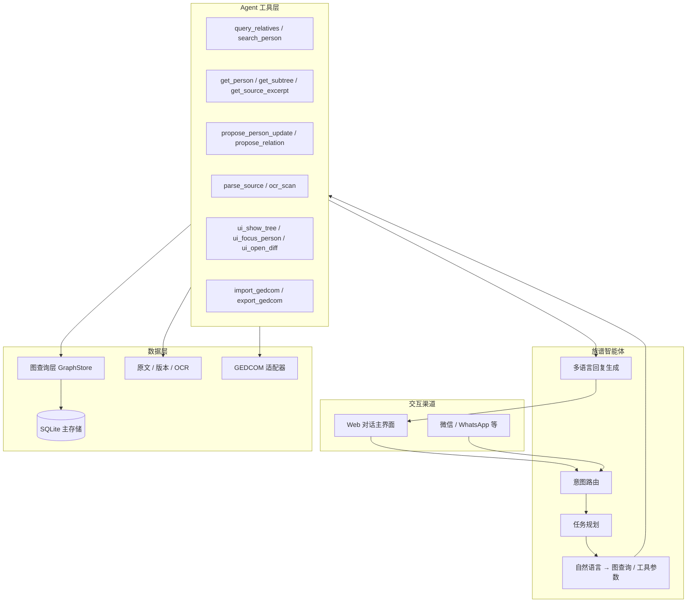

# 族见 · 对话式族谱智能体 PRD（v2 大改方向）

> **文档版本**：v0.5 · 2026-05-24  
> **分支**：`feat/conversational-agent`  
> **产品定位**：**以智能体为核心的族谱应用**（从一开始就是 Agent-first，不是后期「加 AI」）  
> **借鉴**：[my-family-bot](https://github.com/pbrudny/my-family-bot) 的 **Agent 使用方式**（NL → 工具/图查询 → 自然语言回复），非其功能范围  
> **继承文档**：[`改善计划-2026-05.md`](./改善计划-2026-05.md) · [`PRD-UI-交互.md`](./PRD-UI-交互.md)

---

## 0. 重新设定（v2 起点）

### 0.1 我们有什么、缺什么

| 已有（v1 页面与能力，**保留为可见页面**） | 偏弱（v2 要补强） |
|----------------------------------------|-------------------|
| 垂丝图、成员详情、文字版、解析对比、整理 | **对话与页面联动** |
| OCR / 两阶段解析 / 差异确认入库 | **统一 Agent 会话** |
| AI 整理、字段同步、成员编辑 | **底部 Tab 快捷切页** |
| 会话持久化 | **读谱问答** + 身份锚定 |
| 本地 SQLite + FastAPI + Vue | Web 开发 + **UniApp 小程序**推广 |

**原则：还是一套族谱应用，主交互改成「对话 + 多页面」；页面能手动点，也能用对话优化当前页。**

> 「Agent 工具」是后端术语，指智能体如何切页、改数据；**不是**把页面藏起来只剩聊天。

### 0.2 交付形态：Web 便于开发，小程序便于推广

**两个客户端，同一 Agent 后端**——不是二选一，而是分工：

| 客户端 | 角色 | 说明 |
|--------|------|------|
| **本地 Web（Vue）** | 开发验证主战场 | Agent / 工具 / 画布逻辑迭代快，调试方便 |
| **UniApp → 微信小程序** | **正式发布与推广主渠道** | 小程序分发成本低、家族内传播快；**目标是做好，不是放弃** |
| **响应式 Web** | 过渡 & 局域网真机 | Phase 1 手机浏览器可用；与 UniApp 共用 API 契约 |

```
阶段 1（现在）  本地 Web · Vue + FastAPI + SQLite
                └─ 对话页 + Agent 工具层（快速迭代智能体）
阶段 2（并行推进）Agent API 契约冻结 + UniApp 对话壳
                └─ 微信小程序：对话 + 简化画布 + 拍照/OCR
阶段 3          Web 与小程序功能对齐（建谱 / 整理 / 确认卡片）
阶段 4（可选）  其他 IM 渠道（飞书 / QQ），与 my-family-bot 的 WhatsApp 同级
```

- **数据库**：现阶段 **本地 SQLite** 为主；上线小程序前需 **云端后端 + 用户体系**（Phase 2 末或 Phase 3 规划）。  
- **UniApp 之前调试不便**：因此 **智能体逻辑放后端 + Web 先跑通**，UniApp 只做 UI 壳调 API，减少双端重复调试。  
- **小程序推广**：UI 设计从 Phase 1 起按「单手对话 + 底部画布」移动端优先；API 设计预留 `channel: web | mp-weixin`。

### 0.3 借鉴 my-family-bot 的「智能体用法」

对方 Agent 循环（我们要**继承模式、扩展工具**）：

```
用户消息（WhatsApp）
    → 检测语言
    → LLM 生成只读图查询（Cypher，锚定 $userId）
    → 执行查询
    → LLM 将结果格式化为友好自然语言
    → 回复用户
```

族见 v2 **同款循环，工具箱更大**：

```
用户消息（Web / 日后手机 / IM）
    → 会话记忆 + 族谱上下文（family_id、anchor_person_id、原文摘要）
    → LLM 选择工具（function calling，禁止直接写 SQL/改库）
    → 工具执行（读 / 写草案 / 解析 / UI / GEDCOM）
    → 写操作 → 返回「待确认卡片」，用户确认后才 apply
    → LLM 汇总结果为自然语言 + 可选 ui_* 更新画布
    → 持久化 messages + tool_log
```

| my-family-bot 做法 | 族见 v2 对应 |
|---------------------|--------------|
| `$userId` 锚定问者 | `anchor_person_id`：用户选定「我在谱中是谁」 |
| NL → Cypher（只读） | NL → `GraphStore` 查询工具（只读） |
| 多语言回复 | 中文为主，中英问法兼容 |
| WhatsApp 渠道 | **Channel 适配器**；首 channel = 本地 Web Chat |
| 无写入 | `propose_*` + 用户确认 + `apply_*` |

---

## 1. 愿景

做一个**对话式族谱智能体应用**：用户主要通过**说话**完成建谱、查谱、改谱；同时屏幕上始终有**可操作的页面**（树图、原文、详情、对比等），底部可**快速切换页面**；对话用来**理解意图、优化当前页、跨页串联任务**。

| 维度 | my-family-bot | 族见 v2（本方向） |
|------|---------------|-------------------|
| 产品形态 | 纯聊天问答 | **对话 + 多页面工作台**（页面可手点，也可被对话驱动） |
| 数据入口 | MyHeritage GEDCOM 导入 | OCR 扫描、文字版、手工录入、GEDCOM 导入 |
| 存储 | Neo4j 图数据库 | **阶段 1：本地 SQLite + 图查询层**；阶段 2：可选 Neo4j / 云 PG |
| 交互渠道 | WhatsApp 群 | **微信小程序（UniApp）推广** + Web 开发调试 + 日后飞书/QQ |
| 问法 | 「我堂兄弟是谁？」 | 「用文字/语音描述、可带图片，生成族谱」「我堂兄弟是谁？」+ **中族谱语境** |
| 写入 | 只读查询 | **读 + 建议 + 经确认写入**（保留差异确认铁律） |
| 可视化 | 无 | **垂丝图 / 原文 / 详情 / 对比** 等独立页面，底部 Tab 切换 |
| 开发策略 | 单体式 | **Agent API 先行**；Web 验证智能体 → **UniApp 小程序正式发版** |

### 1.1 差异本质：完整智能体 vs 只读问答切片

**my-family-bot 做的是族谱 AI 里的一小块**——且完成度很高，但边界清晰：

```
GEDCOM 导入 → 图数据库 → 自然语言转 Cypher → 只读回答 → WhatsApp 推送
```

它**假设树已经建好**（MyHeritage 导出），**不做**扫描/OCR、不做关系整理与写入、不做原文校对、不做可视化编辑、不做多轮建谱任务。本质是 **Family QA Bot**（亲属问答机器人）。

**族见 v2 要做的是端到端族谱智能体（Genealogy Agent）**，对话是主入口，智能体负责**整条链路**：

| 能力域 | my-family-bot | 族见 v2 完整智能体 |
|--------|---------------|-------------------|
| **建谱** | ✗ 依赖外部 GEDCOM | OCR / 图片 / 语音 / 文字描述 → 解析 → 差异确认 → 入库 |
| **读谱** | ✓ NL → 图查询 | ✓ 同上 + 中文亲属称谓 + 字辈/支系/过继 |
| **改谱** | ✗ 只读 | 单成员编辑、批量整理方案、文字版字段回填（均须确认） |
| **理谱** | ✗ | AI 整理 plan、merge/replace 策略、冲突诊断 |
| **原文** | ✗ | 版本管理、摘录高亮、原文 vs 主谱 diff |
| **可视化** | ✗ | **垂丝图 / 原文 / 详情 / 对比** 等页面，底部 Tab 切换 + 对话可驱动 |
| **国际兼容** | ✓ GEDCOM | GEDCOM 导入导出 + 中国字段扩展 |
| **交互** | 单渠道 IM | Web 对话为主，多渠道适配器预留 |
| **任务形态** | 单轮问答 | **多轮任务**：建谱、补全、整理、导出可跨多轮持续推进 |

一句话：**对方是「只能问」；我们要的是「能看、能点、也能说——说话帮你看对页、改对数据」**。

### 1.2 产品交互模型（你要的形态）

**不是**「聊天框 + 隐藏功能」，**而是**「对话式工作台」：

```
┌──────────────────────────────────────┐
│  页面区（当前 Tab 的内容，可手动操作）   │  ← 树图 / 原文 / 成员详情 / 对比 / 整理
│  例：正在看垂丝图，可点节点、缩放      │
├──────────────────────────────────────┤
│  对话区（主交互，可上滑全屏）           │  ← 输入文字/语音/图片
│  · 回复 + 待确认卡片                   │
│  · 「打开原文」「高亮张三」→ 自动切 Tab  │
├──────────────────────────────────────┤
│  🌳树图 │ 📜原文 │ 👤成员 │ ⚖对比 │ ✨整理 │  ← 底部快捷切页
└──────────────────────────────────────┘
```

**三种操作方式并存，不互斥：**

| 方式 | 例子 |
|------|------|
| **说话** | 「帮我把文字版字号补到当前这个人」→ 在成员页执行并刷新 |
| **点底部 Tab** | 从树图切到原文，继续手工改字 |
| **在页面里直接点** | 树图点节点看详情、对比页勾选入库 |

**对话如何「优化页面」**（核心体验）：

- 智能体知道 **当前在哪个 Tab、选中了谁**，话里带的「他」「这一支」「当前页」有指代。  
- 用户说「整理一下，别删人」→ 切到整理页 / 弹出预览 → 确认后刷新树图。  
- 用户说「展开第 5 代」→ 树图页自动滚动/展开，无需自己找。  
- 用户先在树图点了「张三」，再说「他和李四什么关系」→ 带着张三上下文回答。

### 1.3 智能体能力分层（后端视角）

```
┌─────────────────────────────────────────────────────────┐
│ L4 交互 · 对话 + 多页面 + 底部 Tab（Web / 小程序 …）   │
├─────────────────────────────────────────────────────────┤
│ L3 认知 · 意图理解、任务规划、多轮记忆、中文族谱语境       │
├─────────────────────────────────────────────────────────┤
│ L2 工具 · 读/写/解析/OCR/整理/UI/GEDCOM（带确认策略）     │
├─────────────────────────────────────────────────────────┤
│ L1 数据 · 主谱 + 原文版本 + 图查询 + GEDCOM 适配          │
└─────────────────────────────────────────────────────────┘
```

my-family-bot 大致只覆盖 **L1（图）+ L3 一小条（NL→查询）+ L4 一个渠道**；族见 v2 四层都要做全。

---

## 2. 核心原则（继承 + 升级）

### 2.1 保留（来自改善计划）

1. **差异确认铁律**：任何批量入库必须先预览、用户确认，禁止静默 merge。  
2. **四层能力分离**（实现方式变，职责不变）：
   - **对话层**：理解意图、编排工具、解释结果  
   - **执行层**：整理方案 apply、解析入库、字段同步  
   - **确认层**：对比弹窗、选择性 checkbox  
   - **可视化层**：树图/详情/原文，由 Agent 或用户唤起  

3. **P1/P2 改善项**全部纳入 v2 路线图（见 §6），不因换 UI 而丢弃。

### 2.2 新增（v2 交互）

1. **对话 + 页面双主轨**：页面照常存在、可手动操作；对话负责意图理解与跨页编排。  
2. **当前页上下文**：Agent 会话携带 `active_tab`（tree / source / person / diff / organize）+ `selected_person_id`，回复与操作针对「正在看的这一页」。  
3. **底部 Tab 快捷切页**：树图、原文、成员、对比、整理——与 v1 能力一一对应，**不是**取消这些页面。  
4. **对话驱动页面**（后端称 UI 指令，用户无感）：切 Tab、聚焦节点、打开对比——等价于帮你点了一遍。  
5. **身份锚定**：「我在谱中是谁」，亲属问法准确。  
6. **写操作仍须确认**：对话可发起，对比/整理页上勾选或卡片确认后才入库。

#### 页面 ↔ 后端能力（实现映射，供开发参考）

| 用户看到的页面 | 手动能做什么 | 对话能额外做什么 |
|----------------|-------------|------------------|
| 🌳 树图 | 点选、缩放、看世代 | 「展开第 N 代」「定位到张三」 |
| 📜 原文 | 编辑、保存文字版 | 「扫这张图」「保存并同步字号」 |
| 👤 成员 | 编辑字段、增删 | 「补全字号」「把他父亲改成…」（确认后） |
| ⚖ 对比 | 勾选入库项 | 「只导入新增的人」 |
| ✨ 整理 | 预览方案、应用 | 「整理，合并别删人」 |

---

## 3. 目标架构



### 3.1 图查询层（对标 Neo4j，先轻后重）

**阶段 1（本分支 MVP）**：在现有 `persons` + `relations` 上实现 `GraphStore` 抽象：

- `get_ancestors(person_id, depth)`  
- `get_descendants(person_id, depth)`  
- `get_siblings(person_id)`  
- `get_cousins(person_id, degree)` — 支持「堂/表」中文标签  
- `find_path(a_id, b_id)`  
- `search_by_name / generation / courtesy_name`

**阶段 2**：GEDCOM 导入后可选同步到 Neo4j；或 SQLite 仅作事务存储、Neo4j 作读优化。

### 3.2 GEDCOM 与国际兼容

| 族见字段 | GEDCOM | 说明 |
|----------|--------|------|
| name | NAME | 支持西式 `Given / Surname` |
| courtesy_name | _CN字 | 自定义扩展 tag |
| art_name | _CN号 | 自定义扩展 tag |
| generation / generation_name | 可映射 NOTE 或自定义 | 中文辈分 |
| parent_child / spouse | FAM / INDI | 标准关系 |
| 过继 / 出嗣 | ADOP / _CN嗣 | 扩展 |

导入/导出 API：`POST /api/families/{id}/gedcom/import` · `GET .../gedcom/export`

---

## 4. 对话式 UI 设计

### 4.1 布局（v2 默认 · 手机优先）

**大屏**：页面区与对话区可左右分栏；**小屏 / 小程序**：页面全屏 + 对话底部抽屉 + Tab 栏。

```
┌──────────────────────────────────────┐
│ 顶栏：族谱名 · 我在谱中是谁 · 设置      │
├──────────────────────────────────────┤
│                                      │
│           【当前页面内容区】            │
│    tree | source | person | diff     │
│         （复用 v1 各页面组件）          │
│                                      │
├──────────────────────────────────────┤
│  对话消息（最近几条，可上滑全屏）        │
│  [ 输入框 · 语音 · 拍照 · 发送 ]       │
├──────────────────────────────────────┤
│  🌳树图  📜原文  👤成员  ⚖对比  ✨整理   │  ← 底部 Tab，一键切页
└──────────────────────────────────────┘
```

### 4.2 对话与页面如何配合

| 场景 | 用户操作 | 系统行为 |
|------|----------|----------|
| 查关系 | 在树图选中张三，输入「他堂兄弟有谁」 | 带 `selected_person_id` 问 Agent → 回复列表 → 可选「在树图高亮」 |
| 切页 | 输入「去看文字版」或点 Tab 📜 | 切到原文页；对话历史保留 |
| 改当前页 | 在成员页，输入「字号改成子明」 | Agent 出确认卡片 → 确认后刷新成员页 |
| 建谱 | 任意页，拍照 + 「帮我录入」 | 切到对比页展示 diff → 勾选确认 |
| 纯手操 | 只点 Tab、只点树节点 | 不强制说话；Agent 不打扰 |

### 4.3 与 v1 工作区的关系

- v1 的 `App.vue` 工作区 **拆成 Tab 页面组件**，嵌入新壳 `/family/:id/chat`，不扔掉垂丝图/原文/对比。  
- 原「AI 对话弹窗」「整理抽屉」→ 并入**常驻对话区 + 整理 Tab**，减少弹窗层级。  
- 旧路由 `/workspace` 暂保留，新默认入口为 `/chat`。

---

## 5. Agent 工具清单

### 5.1 工具分层

| 层级 | 工具 | 来源 |
|------|------|------|
| **读谱**（优先，借鉴 my-family-bot） | `query_relatives` · `search_persons` · `get_person_detail` · `find_relationship` | 新建 GraphStore |
| **原文** | `get_source_text` · `sync_compare` · `get_source_excerpt` | 已有 source API |
| **建谱** | `ocr_scan` · `parse_import_preview` · `import_confirmed_persons` | 已有 OCR/解析 |
| **改谱** | `propose_person_patch` · `sync_person_details` | 已有 persons/sync API |
| **理谱** | `propose_organize_plan` · `apply_organize_plan` · `rebuild_preview` | 已有 ai-organize |
| **UI** | `ui_switch_tab` · `ui_focus_person` · `ui_show_diff` | 对话驱动切页/高亮（用户也可自己点 Tab） |
| **交换** | `import_gedcom` · `export_gedcom` | 待建 |

### 5.2 工具注册表（初版）

| 工具名 | 类型 | 说明 |
|--------|------|------|
| `query_relatives` | 读 | 堂表兄弟姐妹、祖先 N 代等 |
| `search_persons` | 读 | 姓名/字/号/世代模糊搜 |
| `get_person_detail` | 读 | 含 source_excerpt |
| `get_source_text` | 读 | 当前确认版原文 |
| `sync-compare` | 读 | 原文 vs 主谱 diff |
| `propose_organize_plan` | 写（草案） | 返回 plan，不 apply |
| `apply_organize_plan` | 写 | 需用户 confirmation_token |
| `sync_person_details` | 写 | 文字版 → 空字段回填 |
| `propose_person_patch` | 写（草案） | 单成员字段更新 |
| `parse_import_preview` | 读 | OCR/文本解析预览 |
| `import_confirmed_persons` | 写 | 仅 confirmed ids |
| `ui_switch_tab` | UI | 切换到 tree/source/person/diff/organize |
| `ui_focus_person` | UI | 树图/成员页高亮并选中 |
| `ui_show_diff` | UI | 打开对比页并带入数据 |
| `export_gedcom` | 读 | 导出文件 |
| `import_gedcom` | 写 | 预览 → 确认入库 |

---

## 6. 分阶段路线图（重新设定）

### Phase 0 — 文档与分支 ✅

- [x] 分支 `feat/conversational-agent`
- [x] PRD v0.4：Agent 核心 + Web 开发 / **UniApp 小程序推广** 双客户端

### Phase 1 — 本地 Agent 内核（当前重点）

- [x] **`AgentRuntime`**：`POST /api/families/{id}/agent/chat`（message → tools → reply）
- [x] **`GraphStore`** + `query_relatives` / `find_relationship`（借鉴 NL→图查询）
- [x] **`anchor_person_id`** 设置与持久化
- [x] 注册读谱 / 搜索 / UI 工具（query / search / get_person / ui_switch_tab / ui_focus_person）
- [x] 对话页壳 **FamilyChatShell**（页面区 + 底部 Tab + 对话条）
- [x] 上下文：`active_tab` + `selected_person_id` 随请求传给 Agent
- [ ] **SQLite 本地**：沿用现有库，新增 `agent_tool_log` 表（可选）

### Phase 2 — v1 建谱能力接入 Agent

- [ ] 将 OCR、解析对比、整理 apply、sync-person-details **注册为写工具**（带确认卡片）
- [ ] 统一会话：合并现有 `ai-organize` 消息流到 Agent 会话
- [ ] 对话内嵌 diff / organize 预览（替代部分抽屉）

### Phase 3 — 移动端体验 + UniApp 小程序（与 Web 对齐）

- [ ] 语音输入、图片/拍照（Web Speech API；小程序用原生能力）
- [ ] 对话全屏 + 画布 bottom sheet（Web 响应式 + UniApp 同一交互规范）
- [ ] **UniApp 项目**：Chat 页 + 简化 Canvas，**只调 Agent API**
- [ ] **微信小程序**提审所需：用户登录、隐私协议、云后端部署
- [ ] P1/P2 改善项在对话 UI 内验收（Web 与小程序共用 API）

### Phase 4 — 发布与推广

- [ ] 小程序正式发版（家族邀请、分享卡片、谱内 @ 助手）
- [ ] Web 版可选同步公开（或仅作管理端）
- [ ] GEDCOM import/export
- [ ] 其他 Channel：飞书 / QQ（可选）

### Phase 5 — 数据层升级（小程序上线前后）

- [ ] 云部署 API（小程序不能长期指向 localhost）
- [ ] PostgreSQL / 用户与族谱权限
- [ ] Neo4j 或专用图库（读优化，可选）

---

## 7. 技术栈与约束（本地版）

| 项 | 选型 | 说明 |
|----|------|------|
| 前端（开发） | Vue 3 + Vite | 本地 `npm run dev`，Agent 迭代主战场 |
| 前端（发布） | **UniApp → 微信小程序** | 推广主渠道；与 Web **共用 Agent API**，不重写业务 |
| 后端 | FastAPI + Python | 本地 :8080 开发；上线需云托管 |
| 数据库 | SQLite → 云 PG | 本地验证；**小程序上线前**迁云 |
| Agent | LLM function calling | 复用现有 multi-provider 配置 |
| 调试策略 | 智能体在后端 + Web 先通 | 降低 UniApp 调试成本，API 稳定后小程序只接 UI |
| 部署 | 本机验证 → 云 API | 小程序必须指向公网 HTTPS |

---

## 8. 技术备注

- **LLM**：继续支持多 Provider；Agent 使用 function calling / JSON tool schema。  
- **会话**：`session_id` 持久化（已有）+ **tool 执行日志**可审计。  
- **安全**：写工具必须带 `family_id` 校验；`apply_*` 需显式用户确认 token（防 prompt injection 直写库）。  
- **中文 NLP**：关系词表（父、母、配、嗣、出继、房、支）维护在 `backend/agent/lexicon/zh_relations.yaml`。

---

## 9. 修订记录

| 日期 | 说明 |
|------|------|
| 2026-05-24 | v0.1 初稿：定义对话式 v2 与路线图 |
| 2026-05-24 | v0.2 明确与 my-family-bot 差异：完整智能体 vs 只读问答切片 |
| 2026-05-24 | v0.3 重新设定：Agent 核心、v1 工具化、本地 SQLite 优先、借鉴 Agent 用法 |
| 2026-05-24 | v0.4 修正：UniApp/小程序为推广主渠道；Web 为开发调试 |
| 2026-05-24 | v0.5 澄清交互：对话+多页面+底部 Tab；页面可手操，对话优化当前页 |
| 2026-05-24 | **新增 [`PRD-V1-交付清单.md`](./PRD-V1-交付清单.md)**：V1 完成定义与验收，愿景文档保持不动 |
