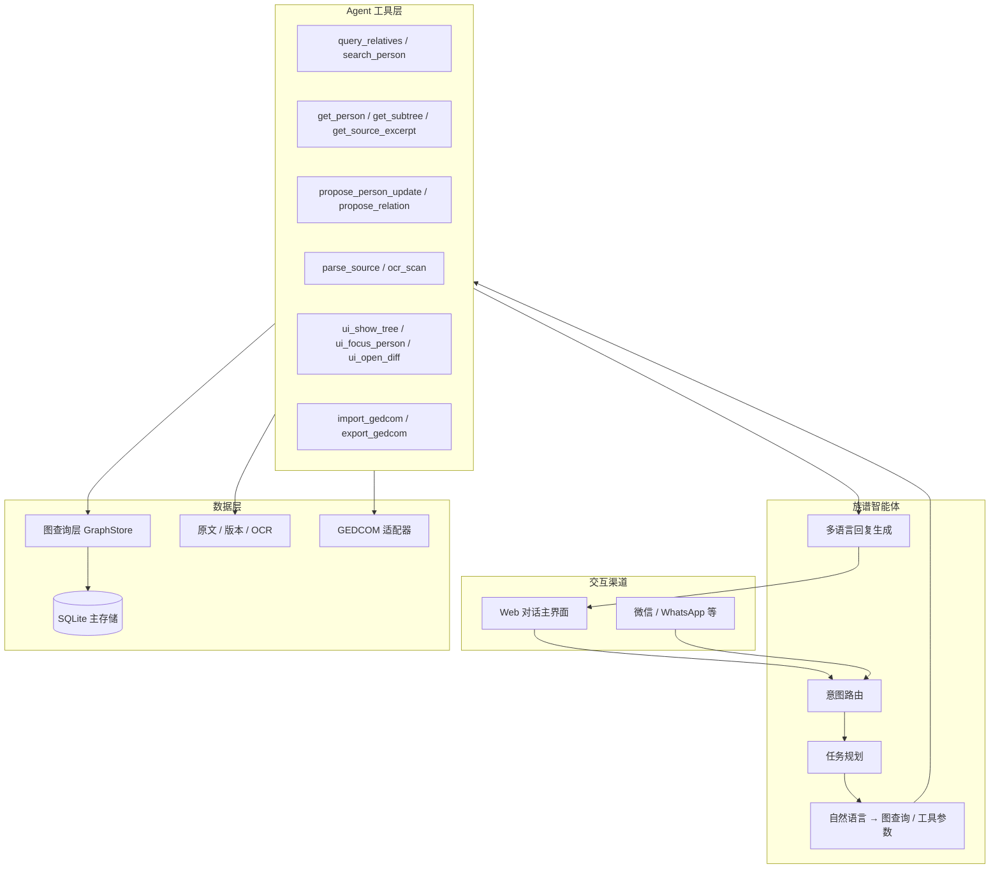

# 族见 · 对话式族谱智能体 PRD（v2 大改方向）

> **文档版本**：v0.1 · 2026-05-24  
> **分支**：`feat/conversational-agent`  
> **对标参考**：[my-family-bot](https://github.com/pbrudny/my-family-bot) · [Medium 架构文](https://medium.com/@pbrudny/building-a-family-tree-ai-assistant-from-gedcom-to-whatsapp-bot-with-a-graph-database-b1fcf0b3cc9e)  
> **继承文档**：[`改善计划-2026-05.md`](./改善计划-2026-05.md) · [`PRD-UI-交互.md`](./PRD-UI-交互.md)

---

## 1. 愿景

做一个**中国可用、国际可兼容**的族谱 **AI 助手**——不是「带 AI 功能的族谱编辑器」，而是**以对话为主入口、具备族谱领域智能的 Agent**。

| 维度 | my-family-bot | 族见 v2（本方向） |
|------|---------------|-------------------|
| 数据入口 | MyHeritage GEDCOM 导入 | OCR 扫描、文字版、手工录入、GEDCOM 导入 |
| 存储 | Neo4j 图数据库 | 阶段 1：SQLite + 图查询层；阶段 2：可选 Neo4j / 双写 |
| 交互渠道 | WhatsApp 群 | **Web 对话为主**（后续可接微信/企微/WhatsApp） |
| 问法 | 「我堂兄弟是谁？」 | 中英文 + **中族谱语境**（字辈、支系、过继、配、嗣） |
| 写入 | 只读查询 | **读 + 建议 + 经确认写入**（保留差异确认铁律） |
| 可视化 | 无 | Agent 驱动：树图/详情/原文面板随对话展开 |

---

## 2. 核心原则（继承 + 升级）

### 2.1 保留（来自改善计划）

1. **差异确认铁律**：任何批量入库必须先预览、用户确认，禁止静默 merge。  
2. **四层能力分离**（实现方式变，职责不变）：
   - **对话层**：理解意图、编排工具、解释结果  
   - **执行层**：整理方案 apply、解析入库、字段同步  
   - **确认层**：对比弹窗、选择性 checkbox  
   - **可视化层**：树图/详情/原文，由 Agent 或用户唤起  

3. **P1/P2 改善项**全部纳入 v2 路线图（见 §6），不因换 UI 而丢弃。

### 2.2 新增

1. **对话即主界面**：打开族谱默认进入「与助手对话」；树图、原文、整理变为 **Agent 调用的画布（Canvas）** 或侧边面板。  
2. **身份锚定**：像 my-family-bot 的 `$userId` 一样，助手知道「当前用户在本谱中的位置」，回答「我的堂兄弟」「我这一支」时从该节点遍历。  
3. **工具调用（Tool Use）**：LLM 不直接改库，只调用注册工具；工具层强制执行权限与确认策略。  
4. **中外双模数据**：内部 Canonical 模型 + GEDCOM 5.5 导入/导出适配层。

---

## 3. 目标架构



### 3.1 图查询层（对标 Neo4j，先轻后重）

**阶段 1（本分支 MVP）**：在现有 `persons` + `relations` 上实现 `GraphStore` 抽象：

- `get_ancestors(person_id, depth)`  
- `get_descendants(person_id, depth)`  
- `get_siblings(person_id)`  
- `get_cousins(person_id, degree)` — 支持「堂/表」中文标签  
- `find_path(a_id, b_id)`  
- `search_by_name / generation / courtesy_name`

**阶段 2**：GEDCOM 导入后可选同步到 Neo4j；或 SQLite 仅作事务存储、Neo4j 作读优化。

### 3.2 GEDCOM 与国际兼容

| 族见字段 | GEDCOM | 说明 |
|----------|--------|------|
| name | NAME | 支持西式 `Given / Surname` |
| courtesy_name | _CN字 | 自定义扩展 tag |
| art_name | _CN号 | 自定义扩展 tag |
| generation / generation_name | 可映射 NOTE 或自定义 | 中文辈分 |
| parent_child / spouse | FAM / INDI | 标准关系 |
| 过继 / 出嗣 | ADOP / _CN嗣 | 扩展 |

导入/导出 API：`POST /api/families/{id}/gedcom/import` · `GET .../gedcom/export`

---

## 4. 对话式 UI 设计

### 4.1 布局（v2 默认）

```
┌─────────────────────────────────────────────────────────────┐
│ 顶栏：族谱名 · 当前「我」是谁 · 设置                        │
├──────────────────────────┬──────────────────────────────────┤
│                          │                                  │
│   对话区（主）            │   画布区（Agent 驱动，可折叠）     │
│   - 消息流               │   - 垂丝图 / 详情 / 原文 / 对比    │
│   - 快捷建议 chips       │   - 随 tool ui_* 更新高亮节点     │
│   - 待确认卡片 inline    │                                  │
│                          │                                  │
├──────────────────────────┴──────────────────────────────────┤
│ 输入框 + 附件（图片扫描）+ 「附带原文」开关                    │
└─────────────────────────────────────────────────────────────┘
```

### 4.2 对话能做什么（用户视角）

| 用户说 | Agent 行为 |
|--------|------------|
| 「帮我扫这张谱图」 | 调 OCR → 展示解析摘要 → 打开差异对比卡片 |
| 「张三和第5代什么关系？」 | 图查询 → 自然语言解释 + `ui_focus_person` |
| 「把文字版里李四的字号补进主谱」 | `sync_person_details` → 汇报更新条数 |
| 「整理一下，别删已有的人」 | 生成 organize plan → inline 预览 → 用户确认 apply |
| 「导出 GEDCOM 给 MyHeritage」 | 生成文件链接 |
| 「我这一支有哪些人」 | 以当前用户为根的子树查询 + 树图展示 |

### 4.3 与旧 UI 的关系

- **不一次性删掉** `App.vue` 工作区：先加路由 `/family/:id/chat` 为默认，旧工作区 `/family/:id/workspace` 保留至 v2 稳定。  
- 整理抽屉、AI 弹窗逻辑**下沉为 Agent 工具**，避免两套并行维护过久。

---

## 5. Agent 工具清单（初版）

| 工具名 | 类型 | 说明 |
|--------|------|------|
| `query_relatives` | 读 | 堂表兄弟姐妹、祖先 N 代等 |
| `search_persons` | 读 | 姓名/字/号/世代模糊搜 |
| `get_person_detail` | 读 | 含 source_excerpt |
| `get_source_text` | 读 | 当前确认版原文 |
| `sync-compare` | 读 | 原文 vs 主谱 diff |
| `propose_organize_plan` | 写（草案） | 返回 plan，不 apply |
| `apply_organize_plan` | 写 | 需用户 confirmation_token |
| `sync_person_details` | 写 | 文字版 → 空字段回填 |
| `propose_person_patch` | 写（草案） | 单成员字段更新 |
| `parse_import_preview` | 读 | OCR/文本解析预览 |
| `import_confirmed_persons` | 写 | 仅 confirmed ids |
| `ui_show_tree` | UI | 打开画布垂丝图 |
| `ui_focus_person` | UI | 高亮节点 + 详情 |
| `ui_show_diff` | UI | 打开对比弹窗 |
| `export_gedcom` | 读 | 导出文件 |
| `import_gedcom` | 写 | 预览 → 确认入库 |

---

## 6. 分阶段路线图

### Phase A — 分支基建（当前）

- [x] 创建分支 `feat/conversational-agent`  
- [ ] 本文档评审定稿  
- [ ] `GraphStore` 接口 + 亲属查询单测  
- [ ] 对话页壳（Chat + 空白 Canvas 占位）

### Phase B — 对话主路径 MVP

- [ ] Agent 循环：消息 → tools → 回复（复用现有 `/api/ai/*`）  
- [ ] 接入 `query_relatives` / `search_persons` / `ui_focus_person`  
- [ ] 身份锚定：用户选择「我在谱中是谁」  
- [ ] 移动端：对话全屏 + 画布 bottom sheet  

### Phase C — 写入与确认 inline 化

- [ ] 对话内嵌「待确认卡片」（替代部分 alert/抽屉）  
- [ ] 继承 P1：差异 checkbox、tree_preview、抽屉互斥  
- [ ] `sync_person_details` / organize apply 对话内确认

### Phase D — GEDCOM & 图数据库

- [ ] GEDCOM import/export  
- [ ] 可选 Neo4j 后端（Docker compose）  
- [ ] 多渠道适配器接口（WhatsApp / 微信预留）

### Phase E — 改善计划清零

- [ ] P1/P2 全部项验收  
- [ ] 旧 workspace 路由标记 deprecated  
- [ ] 更新 `PRD.md` / `PRD-UI-交互.md` 为 v2

---

## 7. 技术备注

- **LLM**：继续支持多 Provider；Agent 使用 function calling / JSON tool schema。  
- **会话**：`session_id` 持久化（已有）+ **tool 执行日志**可审计。  
- **安全**：写工具必须带 `family_id` 校验；`apply_*` 需显式用户确认 token（防 prompt injection 直写库）。  
- **中文 NLP**：关系词表（父、母、配、嗣、出继、房、支）维护在 `backend/agent/lexicon/zh_relations.yaml`。

---

## 8. 修订记录

| 日期 | 说明 |
|------|------|
| 2026-05-24 | v0.1 初稿：对标 my-family-bot，定义对话式 v2 与路线图 |
